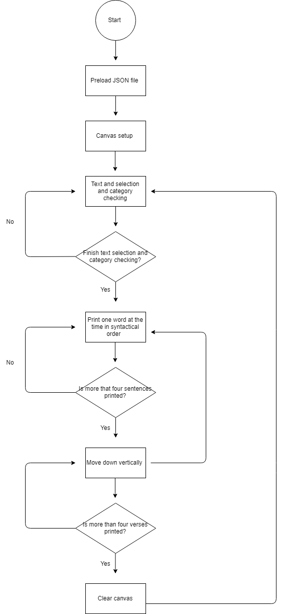
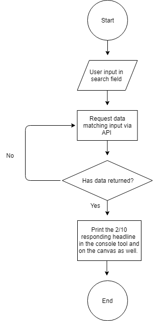
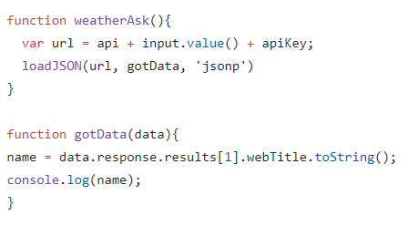

The Female Body 

The idea of this program is a generative set of sentences that describe different kind of female bodies, but always end by declaring that the body is beautiful and feminine (or something like that). The sentences will follow a formula for how the sentences are structured to make sure they make sense. The text will be divided into verses constructed of three or four sentences. When the fourth verse has been generated the screen will clear and a new set of verses will be generated. 

Data capture

The second idea is about data capture using the webcam. We want to create two buttons; a “post” button and a “delete” button. When clicking the “post” button, the picture is posted in the side of the screen. The program will then randomly give the pictures likes. If a picture has less than 5 likes, a text will appear encouraging you to delete this picture. If you click the “delete” button the picture will be deleted and if not it will be kept. 

Present two different ideas with two different flow charts (it is important to think about the balance between simplicity and complexity. How can we get a sense of what's your program about?)

The balance between simplicity and complicity in our two ideas for our final project, is so that our coded program is made quite simple, whereas our conceptual thoughts about our programs is more complex. We have worked out our ideas by starting with a conceptual idea and theme, and thereby we have brainstormed ideas to illustrate our statements in a simple way. 

What might be the possible technical challenges for the two ideas and how are you going to solve them?

The technical challenges for our idea about the generativity project, might be to make the text appear the way we want to, and make it generate some sentences that all makes sense, and display them in a speed that makes it possible for the reader to read them properly before they disappear. 

In the other idea about data capture, the technical challenge might be to get our ideas about the like selection and the buttons to work intentionally so that our conceptual idea gets visualized.  

Individual: 

How is this flow chart different from the one that you had in #2 (in terms of the role of a flow chart)?

The role of the flowcharts we made for out final project was of a structuring character. Since we have not yet created the program it provides us with an overview of the different phases of the program/code and clarifies the parts of this that might be technical challenging. 
The role of the flowchart for my mini_ex8 his more reflective and forces you to think of each step of the process.  

If you have to bring the concept of algorithms from flow charts to a wider cultural context, how would you reflect the notion of algorithms? (see if you could refer to the text and articulate your thoughts?)

It Is definitely interesting to consider how algorithm form and affect our lives. Netflix, Spotify and Instagram all has an algorithm that calculates which profiles, films and much more that is more likely to fall in your interest. But even though these algorithms often seems to actually provide you with something you find interesting they are still not able to calculate deviations like your mood, weather or not you grown tired of a specific genre, or if the data the algorithm is calculated from, is something you only looked at because of a school project and therefore, not a good foundation for calculating. 

