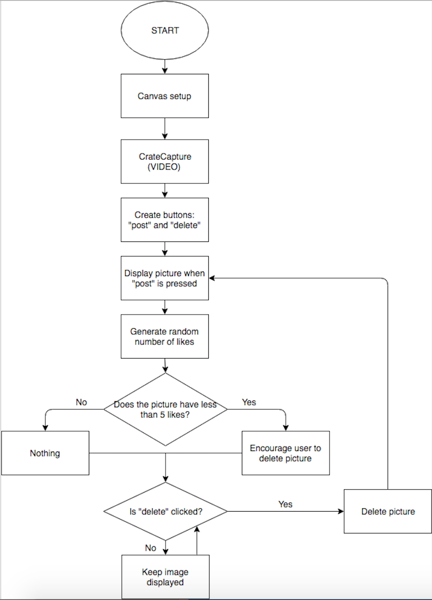

The Female Body 

The idea of this program is a generative set of sentences that describe different kind of female bodies, but always end by declaring that the body is beautiful and feminine (or something like that). The sentences will follow a formula for how the sentences are structured to make sure they make sense. The text will be divided into verses constructed of three or four sentences. When the fourth verse has been generated the screen will clear and a new set of verses will be generated. 

Data capture

The second idea is about data capture using the webcam. We want to create two buttons; a “post” button and a “delete” button. When clicking the “post” button, the picture is posted in the side of the screen. The program will then randomly give the pictures likes. If a picture has less than 5 likes, a text will appear encouraging you to delete this picture. If you click the “delete” button the picture will be deleted and if not it will be kept. 

