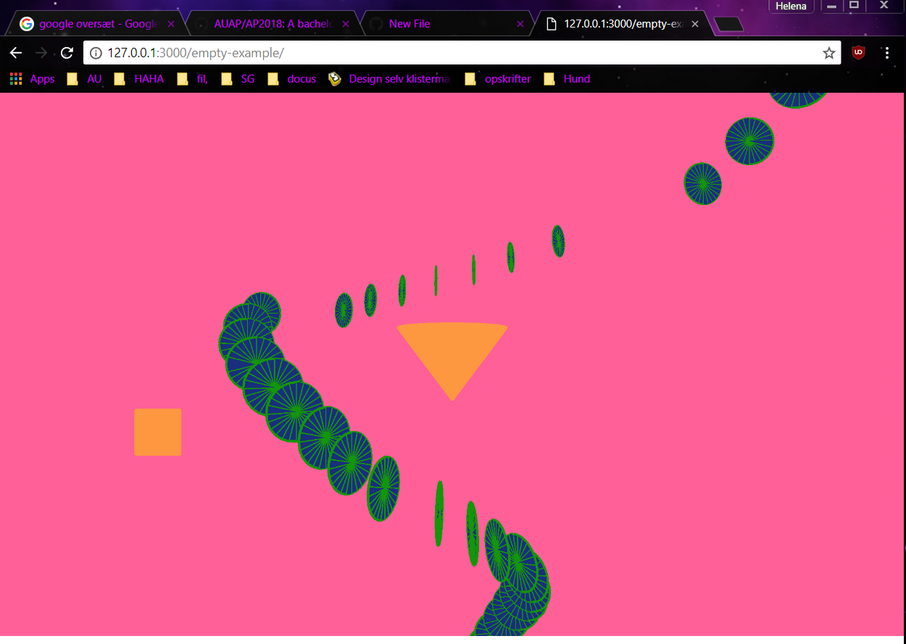

Thinking about my first program

Since I have never programmed or tried to understand what it means, I started from ground zero. Therefore, there was a lot of basic things that did not make sense. For that reason, my priority of this mini exercise has been to get to know a few basic ‘commands’ very well, to, hopefully take a step further in the direction of understanding programming. 

The first thing that raised questions in my head was the two first functions already typed in when you open the program. I tried to type in different ‘commands’, but nothing seemed to differ from when I typed in ‘setup’ from when I typed it in ‘draw’. Thanks to the internet I found out it is a matter of how may times the command is being performed. So, if something is written in the function setup, the command will only be performed one time, which is when the program opens. If written in the function draw it will constantly be redrawn. I could not see the difference in the performance of the commands because the figures I asked the program to draw were static. 
Finally, I discovered that there is a lot more different functions like seen in my program the ‘mousePressed’. This allows the program only to perform when the mouse is clicked. 

There are three different shapes in the program: a cone, a rectangle and an ellipse. The rectangle is only manipulated in looks and placement on the canvas. Its syntax includes with and height, as well as coordinates. Other than that, it has been filled and stroked in the same colour. 
The fill and stroke caused me some thought. Since they are applicable to every command under themselves, it must be commanded to do otherwise if you don’t want the same colour on all your shapes. The syntax is connected to a colour scheme where the colour is calculated by the number of the colour. This is a system that allows you to pick the precise colour and nuance you want, but it is something I will have to practice a lot since I am only used to see colour as colour and not as numbers. 

The ellipse and the cone both have a command for movement. The ellipse moves when the mouse is clicked, and the cone does it all the time. 
The movement of the cone is a rotation around its y-axis. Since the background is written in the setup function it will only be drawn one time when the program is started. Therefore, you can only see its movement in the very beginning of the program because the earlier drawings of the cone are not being deleted by a new drawing of the background. This could have been avoided if the background was written in the draw function.

This is the big problem of this program. I have not been able to make the program perform both the command of having the background in the draw function and making it perform the commands in the mousePressed function. The movement of the ellipse is determinated by my two variables circleX and circleY, which are the coordinates. These are aggregated with twenty and ten to make it move a slant movement to the right of the canvas. But since the rotation command is above this one it applies on the ellipse as well. I have not yet discovered the command to make sure this does not happen. 

 

