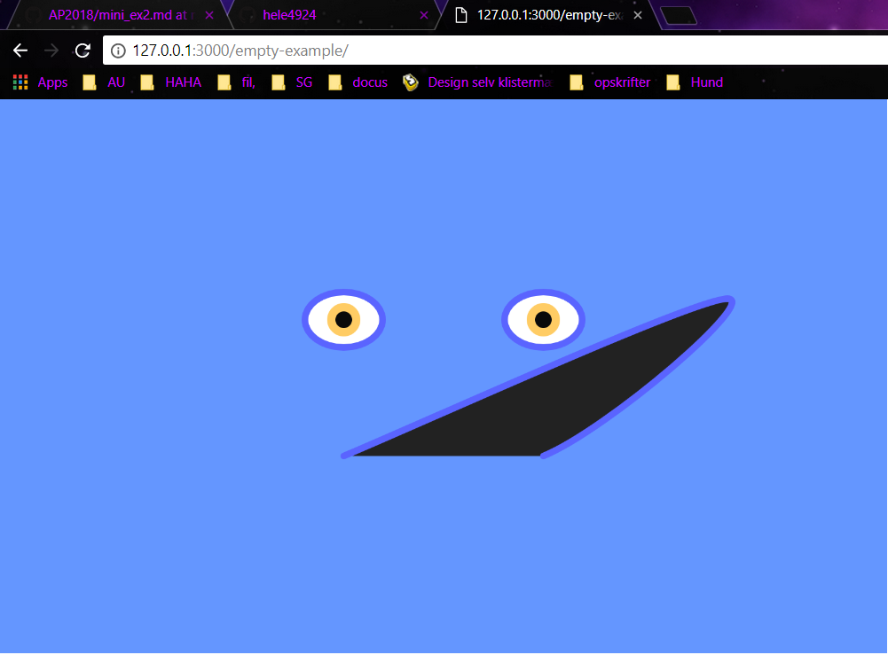

 
https://rawgit.com/hele4924/mini-ex/master/mini_ex2/empty-example/index.html

**Description of program**
The program looks like a face where the user can control the movement of the mouth by moving the mouse. First of all, to make this feature I had to use the ‘vertex()’ syntax which allows me to draw whatever I want, in whatever shape I want. This command only askes for x and y coordinates. The same with the ‘curveVertex()’ that makes the mouth round. But instead of entering a y-coordinate it is defined by the movement of the mouse. 
The second feature of the blue man program is the left-eye-blinking and the pink cheeks. This happens when the ‘mouseIsPressed()’. This feature did give me a lot of trouble when I tried to program it. In the beginning I tried to put this movement under the function ‘mousePressed’, but for some reason nothing happened. I still do not know why that is. But it made me discover the ‘If mouseIsPressed()’ which, I think, is not a function. 
Another thing that gave me trouble during the programming, was the fact that I could not figure out how the different command are ranked in terms of which shape is on top of the other. 
