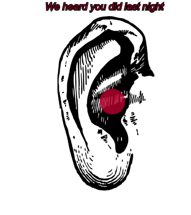

[We know what you did last night](https://rawgit.com/hele4924/mini-ex/master/mini_ex4/empty-example/index.html)

In primary school we had these noise level devices whose interface consisted of an ear that would have little lights blinking in different colours depending on how loud the children would get. The purpose of the device was to raise awareness of tinnitus and other ear problems caused by noise. 
Imagine if these devices had other hidden functions than just showing the level of noise. Even though, this device was very simple and only registered the sound level, the data recorded was worth something. In the end, if it could provide some knowledge that would lead to the sound level dropping and thereby have less people with tinnitus, the government would have saved some resources.  

As in the above example, the collection of data can be used to create new knowledge that can prevent negative consequences. But when data becomes worth something it also becomes a target for a market and therefore is not necessarily treated with caution.  Today, it is common knowledge that every click and every input you do on the internet is being registered somewhere and used to make your internet experience more personalized. Since the internet is used for almost everything in today’s society, one can argue that your entire life is now stored. As a result, you are losing a big part of your privacy. Everything is recorded, you never know when somebody is listening or watching you.  
This perspective of the data collection is what I tried to illustrate with this program. To have the ellipse expand according to the sound level will make people aware that a computer is registering your voice. Combined with the picture of the ear and the text I hoped to provoke a reflection of how we use the internet and how the internet uses us. 

