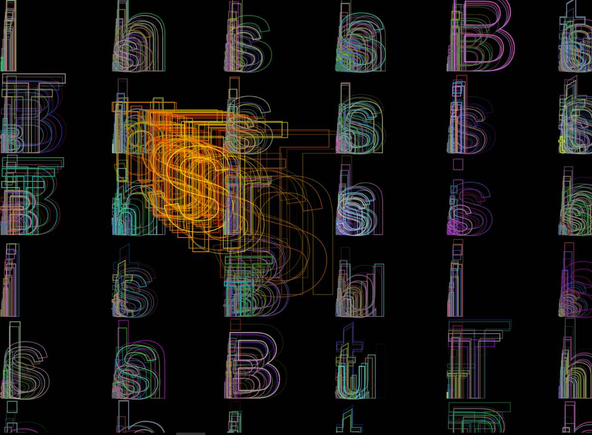

 
[bullshit](https://rawgit.com/hele4924/mini-ex/master/mini_ex6/empty-example/index.html)

Rules of the program 
1.	Letters size and colours are random. 
2.	There is a 30% chance that the program will only write the first four letters 

When I started this assignment, I thought it would be kind of easy because of the random element in generative art. But once again, I got very frustrated in my programming process because I could not figure out how to realize the ideas and rules I had made. I gave up and started over several times and at some point, I was so irritated even a functioning canvas made me happy. Therefore, I ended up creat-ing my program before the rules (why there is only two). 
Even though the program looks very organized in terms of the location of the letters the random ele-ments of the program is created with the Noise()- and random() -syntax. Also, there is a probability of 30% that the program becomes less controlled in terms of text content, size and location.
But if this is enough randomness to call this program generative, I do not know. 

What the program made me think of, is the notion of fun in programming. Even though, my reaction to my frustration might seem a bit childish (the letter combination). I like the fact that when you look at the running program, it is not always possible to figure out what the meaning of the words is trying to say, but when you look at the code you realize what it is. 

