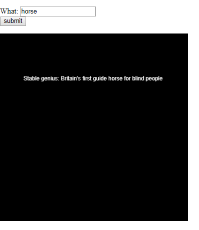
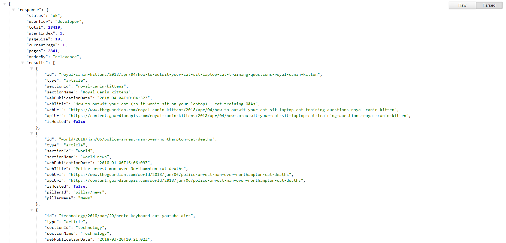

Collaboration  with [Line](https://github.com/lineheeschjessen/Mini-exes/tree/master/mini_ex8)

[Headline](https://rawgit.com/hele4924/mini-ex/master/mini_ex8/empty-example/index.html)

The program is a kind of search engine that shows a headline from the online edition of the newspaper The Guardian. Both the program and the code are very simple. The API URL, the search word and the apikey sends a query to The Guardian’s database to find headlines that contains the search word and then return with ten headlines that matches this query. 
The data returned from the page can seem a bit unmanageable, but when parsed it is easier to see the logic behind the output of the program. The ten headlines that the API returns, is within the ‘response’-array and the program only shows the second headline within the array. 

What I find considerable about the program is the API response of the query. First of all, it is interesting how data is constantly saved for several beneficial reasons like when ex. Instagram suggest profiles for you to follow that matches what you have been looking at previously. But on the other hand, this data is also something you do not have control over and you never know if it ever leaves the storages where it is captured. 
Therefore, I find it questionable that the API of The Guardian only returns with ten headlines, when there is obviously much more Data to give. It creates questions about how these ten headlines are selected and for what reasons. 

